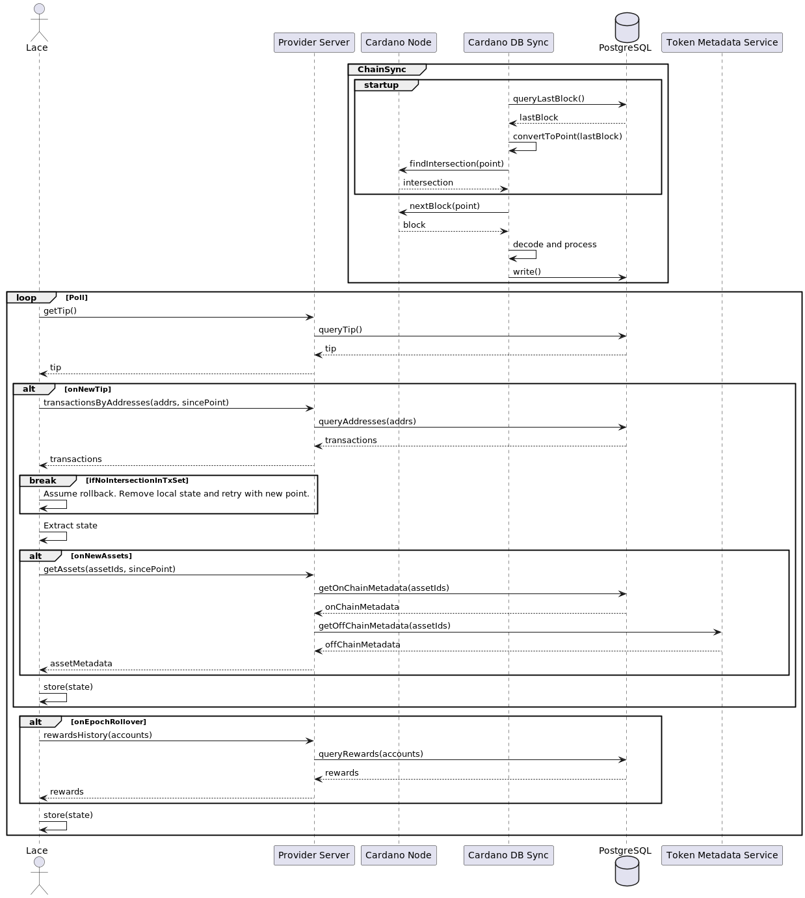

---
CPS:
Title: Sub-Optimal Provider APIs for Wallets
Status: Open
Category: Wallets
Authors:
  - Rhys Bartels-Waller <rhys.bartelswaller@iohk.io>
  - William Wolff <william.wolff@iohk.io>
  - Martynas Kazlauskas <martynas.kaslauskas@iohk.io>
  - Daniele Ricci <daniele.ricci@iohk.io>
  - Hızır Sefa İrken <sefa.irken@iohk.io>

Proposed Solutions: []
Discussions:
  - https://github.com/cardano-foundation/CIPs/tree/master/CPS-0011
  - https://cardano.stackexchange.com/questions/4614/best-practice-for-handling-rollbacks
Created: 2024-07-09
License: CC-BY-4.0
---

## Abstract

The event-based nature of a Blockchain is well-suited for wallets to derive their internal state from genesis, however, most data services only expose a request/response interface and/or take on the responsibility of decoding the native binary data into JSON, enforcing a strong client/server contract with the current protocol transaction format. Wallets must use polling to detect changes, on an interval that balances latency with network and service demand, then make numerous calls against various endpoints that have the potential to change on each protocol upgrade. Rollback handling is either non-existent or rudimentary, requiring defensive workarounds to detect and act accordingly within the protocol rules. Furthermore, the lack of an API standard inhibits development and adoption of a standalone desktop service for wallets to offer a full node experience for their users, which is best achieved via a universal API running either on a remote server, in a multi-tenant mode, or locally running in single-tenant mode.

## Problem

> [!NOTE]
>
> Fundamental wallet functionality is defined in this document as being able to construct and submit any transaction supported by the latest Cardano protocols, requiring:
>
> - **UTxO set** owned by addresses with credentials controlled by the wallet, that are either derived within the 1852 purposed, [BIP32-ed25519](https://input-output-hk.github.io/adrestia/static/Ed25519_BIP.pdf) accounts or the product of hashing a script.
> - **Registered stake pools**: to verify a nominated Stake Pools ID is valid when delegating stake.
> - **Registered DReps**: to verify a nominated DRep is valid when delegating voting rights.
> - **Reward account balances**: to fund the transaction with rewards earned by the stake key registration
> - **Certificates submitted by the wallet**: for understanding stake delegation, voting preferences, and any future extension to the protocol.
> - **Current Cardano network protocol parameters**: for building compliant transactions
> - **Current chain tip**: for setting validity interval and/or creating time-locked scripts

### Impedance Mismatch

- The current APIs available to light wallets tend to be part of a general purpose solution serving many application types, built on top of [Cardano DB Sync] with a request/response interaction style. To achieve a reactive UX and stay in sync with the network state, polling is required to detect progression of the network state and then check if there are any updates relevant to the wallet. i.e. It takes more work than necessary to maintain the event-based nature of the system.

> [!NOTE]
>
> - Wallets require a local node to create a trustless connection with the network for fundamental behaviour, however, the current node technology renders it impractical for most users.
> - While current technology is a limiting aspect today, we can use this as inspiration and guidance to determine a solution that satisfies some of the desirable properties.

### Fragile API

- The API contract between a wallet and most data providers is unnecessarily complex, increasing the maintenance burden and transmission footprint.
- Wallets can easily deserialize CBOR, using readily available client libraries.
- Using Mithril to validate data requires an agreed standard

> [!WARNING]
>
> This fragility in the API creates friction around each protocol upgrade, with wallets needing to synchronise development effort, which often goes through multiple iterations over the course of months.

### Lacking a Standard

- Wallet users, particularly light wallets, have little control over the data source, and subsequently must trust the product team's decisions.
- Users cannot choose their own data provider, independent of the wallet software, which could be self-hosted or from an alternative vendor.
- This complicates or inhibits products offering a full node experience, with a free and open source service, available for users to install then choose their wallet of choice.

### Rudimentary Rollback Handling

- The Cardano blockchain has the potential to roll back blocks as part of resolving a chain fork event.
- Wallets electing to store data fetched from the provider locally must implement a strategy for handling the rollback scenario, which is specific to the application and therefore a responsibility of the client to handle.
- An API querying data from a store is unaware of the rollback occurring, so the client must implement a heavy-handed approach by continually testing the tip meets expectations.
- The result of this approach is a varying level of quality of outcomes in wallets, plus extra complexity and network demand.

> [!NOTE]
> See [What is a rollback](https://plutus-apps.readthedocs.io/en/latest/plutus/explanations/rollback.html) and [CIP-9](https://cips.cardano.org/cip/CIP-9) for detail on `securityParam`.

### Inefficient Address Discovery

- Scanning a [BIP-44](https://github.com/bitcoin/bips/blob/master/bip-0044.mediawiki#account-discovery) keychain for used addresses has the potential to be quite an intensive operation and is non-trivial to implement in the wallet.
- Most APIs support query by address only, missing the simplified alternative approach of using payment and stake key credentials. Funds intentionally or inadvertently sent to an address that would otherwise not be discovered under BIP-44 discovery standards would be found with this approach.
- Funds under the control of unknown [Franken Address](https://www.essentialcardano.io/glossary/franken-address) go undetected, despite the wallet having part ownership.

## Use cases

### Lace Extension

#### What is it doing?

- Transaction data in responses are **transmitted as JSON**, via a **custom schema**
- Data is sourced from the combination of [Cardano DB Sync], Ouroboros Local State Queries, and custom Ouroboros Chain-Sync projections into the PostgreSQL DB.
- **Polling the tip for changes**. An HTTP GET request is made to a webserver every 5 seconds, checking if there's a new tip in the [Cardano DB Sync] database. If so, requests are then made to fetch transactions that are associated with the provided list of addresses after a certain point.
- As there is **no rollback support** in the API, rather than just fetching new data, the last known point's data must be fetched again, so it can be compared with the local state to infer if a rollback has likely occurred. If it has, the state associated with the now void blocks is removed from the stores, then a new request made with the new local tip. This process repeats until an intersection is found with the server and syncing continues as per normal. The wallet ends up requesting the same data repeatedly, which is inefficient and places a higher demand on the DB with unique queries that cannot be practically cached in memory.

> [!NOTE]
> Requests are also made to fetch data on-demand but the scope of this document is to focus on the fundamental wallet requirements, so it's not mentioned here.

#### Why?

- The philosophy in Lace is to place the responsibility of deriving wallet state from the historical transactions, similar to projecting state via the chain-sync protocol.
- Blockfrost was used during the early development of the Lace frontend, however the design of the API to require many small requests conflicts with the rollback handling strategy of Lace, and therefore was not a good fit for fetching transactions.
- A custom API was implemented for this data access, with a batch interface, to query the `cardano-db-sync` database, and later custom projections with more a more optimised schema.
- The API schema was implemented from scratch, based on the domain model, due to the lack of an existing standard.

> [!NOTE]
> Since this API was developed, [Cardano DB Sync] has since added a mode to store transactions in CBOR, but at the time of implementation it was not an option.

#### Current Alternatives

[Blockfrost WebSocket Link] is a partial solution for the impedance mismatch problem, however it's not addressing the fragility and standards problem. It's not practical to run this service to satisfy a single-tenant, full node, use case.

## Goals

- Define a standard API that is optimal for fundamental wallet operation. Consider extensibility for optional enhancement.
- Deliver data as a filtered subset of the network state, using native encoding formats, to simplify server implementations and push processing to the edge of the network.
- Foster long term stability of the API when crossing major Cardano protocol upgrade boundaries.
- Facilitate event-driven wallet behavior, minimising the need for polling, and to increase the sophistication of infrastructure management and user-base insights.
- Support script-based wallets
- Minimise the network demand by allowing the server to control the throttling strategy, rather than a pull-based approach like we see in the local chain-sync protocol.
- API can be applied in a local, single-tenant environment, and a remote multi-tenant deployment, to facilitate a universal approach to wallet supporting an optional full local node for power users.
- Design that supports mobile use cases where a persistent connection is not always possible or preferable.
- Remove or reduce the need for wallets to perform address discovery

## Open Questions

- What identifiers will wallets provide for the server to filter on?
- What is the most efficient solution for indexing data based on account identifiers?
- Will it support multiple accounts?
- How will chain rollbacks be handled?
- What design considerations are made to establish a stable API over network protocol upgrades?
- How will initial sync be made time and network efficient? Can snapshots from the immutable part of the chain be utilised? Is there an advantage to sending batch data in messages?
- Will the API standard support extensions?
- Should verification of stake and voting rights delegation be considered part of fundamental wallet behaviour or an extension?
- Can Mithril be used to verify state snapshots for provided account credentials, to facilitate a fast catchup feature? If not, what is a fallback approach for resource and/or network-constrained applications?
- How will the API behaviour differ for single-tenant use cases?
- Are there any natural authentication strategies?
- Should the Block be transmitted to wallet, similar to the Ouroboros Chain-Sync protocol, or just the relevant transactions?
- Will this API be applicable for other Blockchains?
- Can push notifications be leveraged to address background mobile use cases more optimally?
- Will connections be cheap enough for the client and server to support frequent reconnections from a low quality network scenario?

## Copyright

This CPS is licensed under [CC-BY-4.0](https://creativecommons.org/licenses/by/4.0/legalcode).

[Cardano DB Sync]: https://github.com/IntersectMBO/cardano-db-sync
[Blockfrost WebSocket Link]: https://github.com/blockfrost/blockfrost-websocket-link
